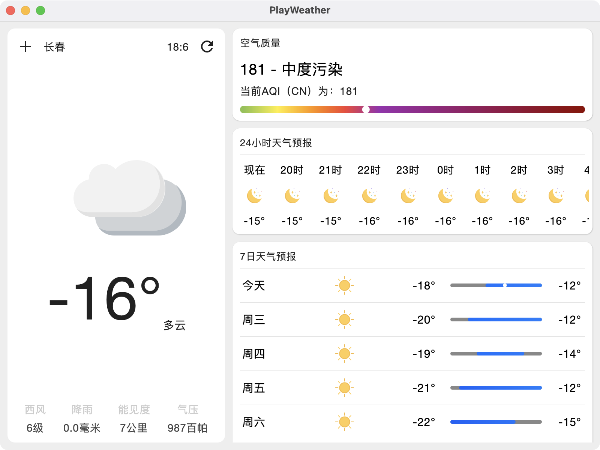

# PlayWeather:玩天气

## 我的新书：《Jetpack Compose：Android全新UI编程》已出版

`Compose` 绝对是 Android UI 的未来，声明式的 UI 已经有太多语言试水了，效果都非常好，大家如果喜欢本书的话，可以点击下面的地址进行购买。另外本书的资源文件大家可以去图灵的官网中进行下载。

[京东购买地址](https://item.jd.com/10039809078875.html)

[当当购买地址](http://product.dangdang.com/593507948.html)

[天猫购买地址](https://detail.tmall.com/item.htm?spm=a220m.1000858.1000725.56.6a61b8d7HhFgCX&amp;id=658828404598&amp;areaId=110100&amp;user_id=2145487409&amp;cat_id=2&amp;is_b=1&amp;rn=1522259deab5178ef65819d1ef6b699e)

## 项目简介

之前写过PlayAndroid：玩安卓的Compose版本，但最近在手机上看天气的时候发现一堆广告，烦得要死，自己写一个吧，正好再练练Compose。 之前写的是安卓版本的天气，这回搞一个桌面版的，让 `Mac`、`Windows`
、`Linux` 都能使用！废话不多说，先来看看项目运行效果吧！

## 项目动图

## 项目截图

|                            |                            |
|--------------------------------------------------------------|--------------------------------------------------------------|
|                            |                            |
|                            |                            |

## 项目使用三方库

- Retrofit:网络请求库
- DataStore:数据存储（Jetpack 中的库）

## 说明

本项目可以让大家用作学习，不可以任何的形式进行商用，最终解释权归本人所有。
